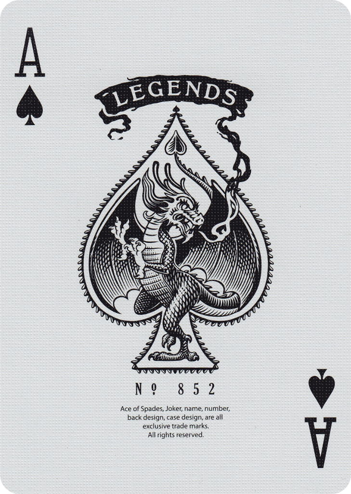

# ♠️Matching Card Game

### 10 card memory game - users are able to select two cards and check if they are a match. If they are a match, they stay flipped. If not, they flip back over. Game is done when all cards are matched and flipped over. 

## Languages used
*HTML
*CSS
*JavaScript 
